## GreenBasket – Online Grocery Store

GreenBasket is a responsive online grocery shopping website built using HTML, CSS, and JavaScript. This project was created to practice and demonstrate frontend development skills, including responsive design, DOM manipulation, and local storage management. It allows users to browse grocery products, add items to their cart, manage wishlists, and place orders through a simple checkout process. This is a learning and portfolio project created for educational purposes and is not intended to be a real commercial grocery website.

## Features

## User Authentication
-User Login & Signup
-Form Validation
-User Session Management using LocalStorage

## Product Management
-Browse Products by Categories
-Product Search Functionality
-Product Details Display
-Dynamic Product Listing

## Wishlist
-Add Products to Wishlist
-Remove Products from Wishlist
-Wishlist Count Indicator

## Shopping Cart
-Add to Cart
-Remove from Cart
-Increase / Decrease Quantity
-Automatic Price Calculation
-Cart Item Counter

## Checkout System
-Shipping Information Form
-Order Summary
-Order Confirmation Page
-Order History Tracking

## Responsive Design
-Mobile Friendly Layout
-Tablet Responsive
-Desktop Optimized
-Flexible Product Grid

## Local Storage Integration
-User Data Storage
-Cart Persistence
-Wishlist Persistence
-Order History Storage

## Project Structure

```text
GreenBasket/
│
├── images/
├── icons/
├── products/
├── screenshots/
│
├── index.html
├── categories.html
├── cart.html
├── wishlist.html
├── checkout.html
├── orders.html
├── account.html
├── success.html
│
├── style.css
├── categories.css
├── cart.css
├── checkout.css
├── account.css
├── success.css
├── orders.css
├── wishlist.css
│
├── script.js
├── categories.js
├── products.js
├── cart.js
├── wishlist.js
├── checkout.js
├── orders.js
├── success.js
├── account.js
│
└── README.md
```

## Screenshots

## Home Page
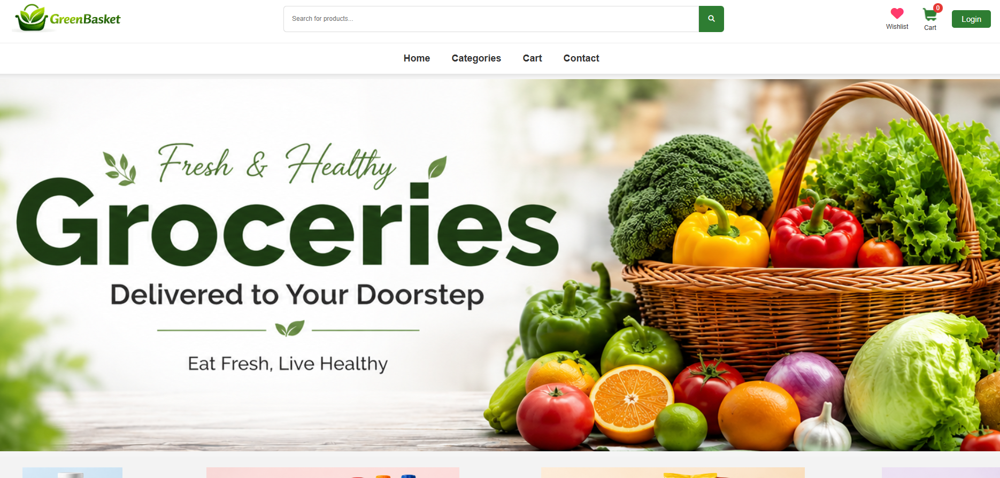
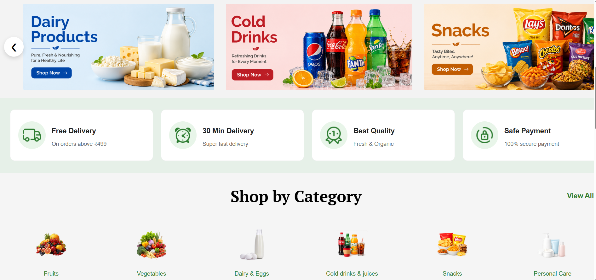
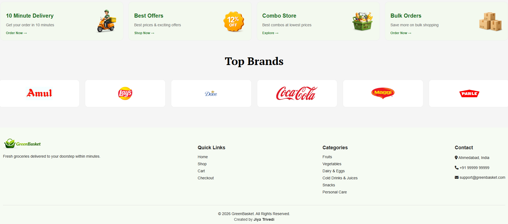

## Product Listing
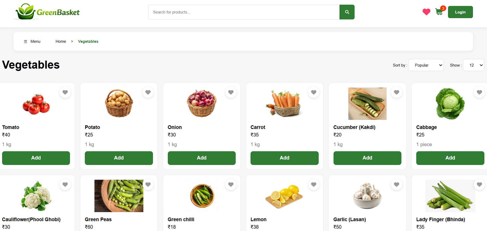

##  Categories Menu
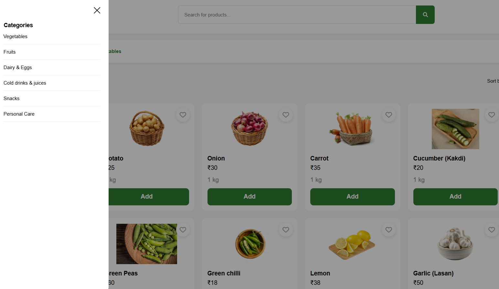

##  Wishlist
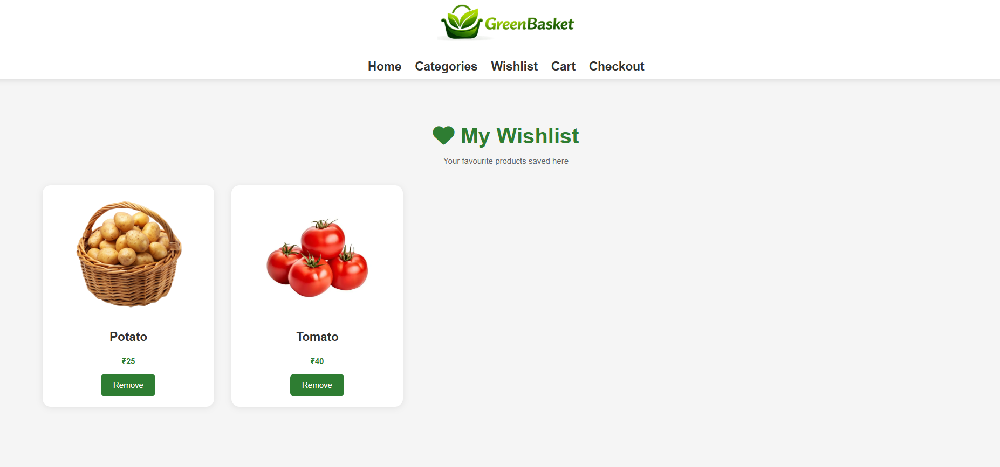

## Shopping Cart
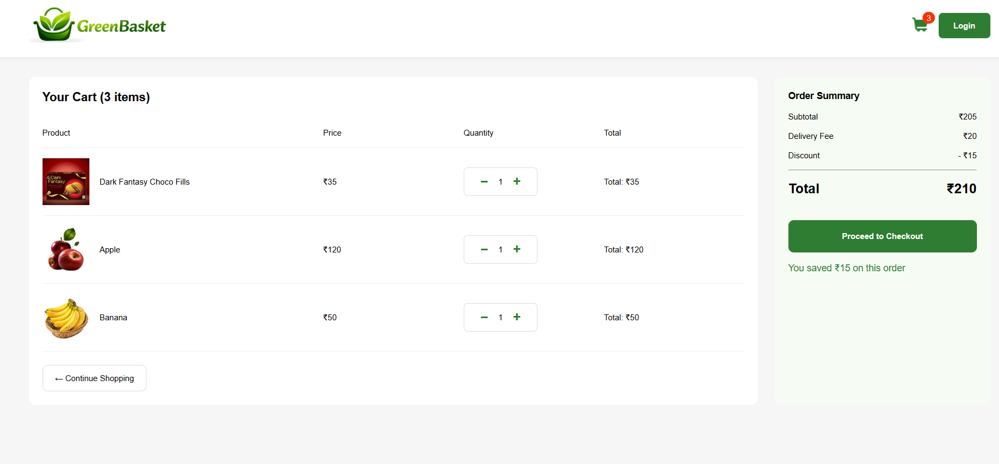

## Checkout Page
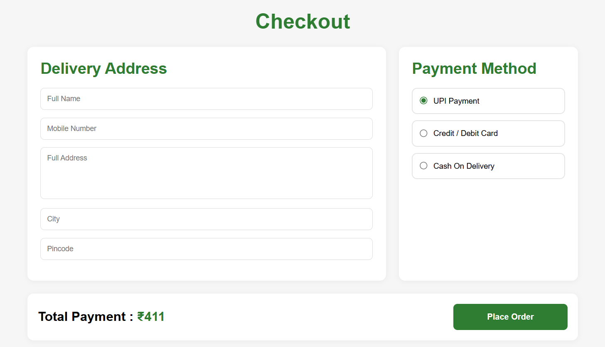

## Order History
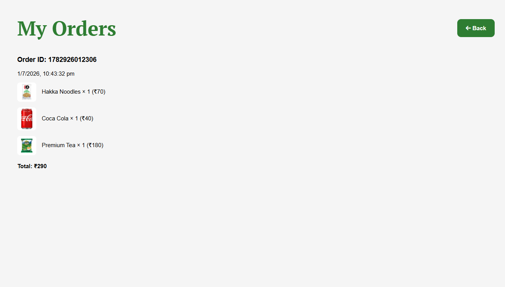

## Login Page
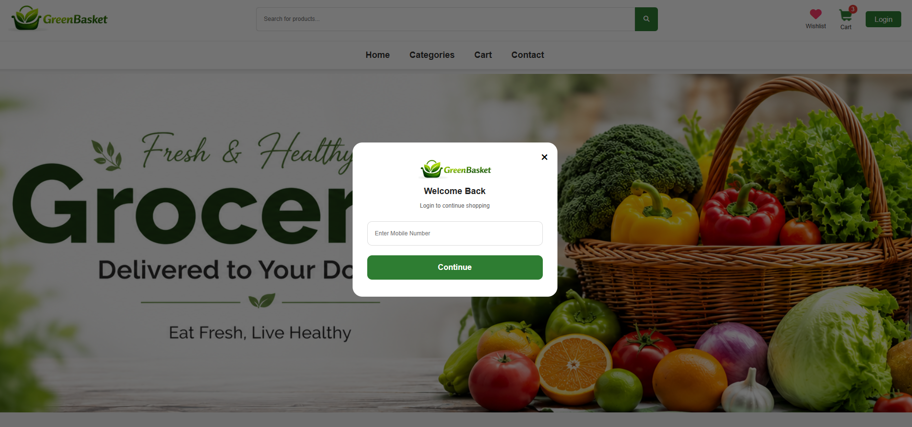

## Account Page
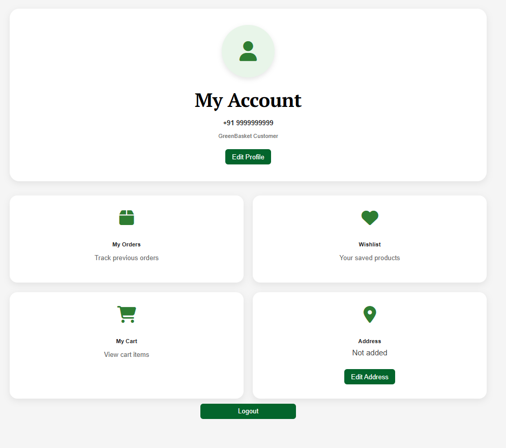

## Technologies Used
- HTML5
- CSS3
- JavaScript (ES6)
- Font Awesome
- LocalStorage API

## Author

Jiya Trivedi
Frontend Developer | Web Development Learner

⭐ If you like this project, consider giving it a star on GitHub.

## License

This project is developed for educational and portfolio purposes.